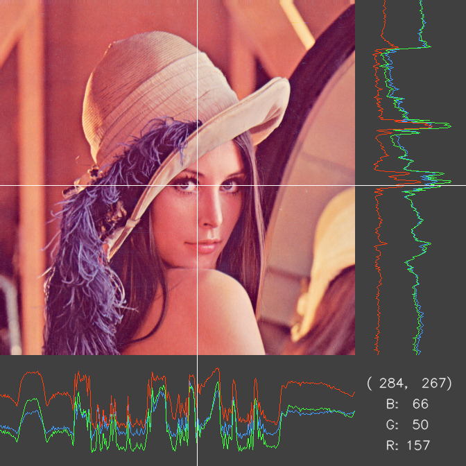

# はじめに

本プログラムは，OpenCV を用いて，以下のような画像プロファイルを表示させるプログラムです．




上記のプロファイル画像を表示させるには次のプログラムコードで可能です．また，これは最も簡潔なプログラム例と言えます．
```cpp
#include <opencv2/opencv.hpp>
#include <image/image_profilter.hpp>

int main()
{
    using namespace show_profile_image;
    cv::Mat im = cv::imread("lena.jpg");

    ImageProfiler imageProfiler;
    imageProfiler.setImage(im);
    imageProfiler.show();
}
```
